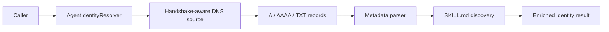

# Architecture Note

The resolver is intentionally separate from hnsd.

hnsd already has its own responsibilities: syncing Handshake headers, requesting
name proofs, translating Handshake resource data into DNS responses, and serving
DNS. This project has a narrower responsibility: finding and normalizing agent
identity metadata for any Handshake name that publishes compatible records.

Keeping those responsibilities separate has three benefits:

- hnsd can remain upstream-compatible.
- The agent-aware resolver can evolve without changing hnsd core behavior.
- Integrators can choose different upstream data sources without changing the
  metadata parser.

## Flow

The current upstream source uses Node's DNS resolver for A, AAAA, and TXT
records. In production, point it at a Handshake-aware resolver. The module can
also accept a custom source for tests or for future proof-backed lookup adapters.

HTTP SKILL.md fetching is intentionally separate from DNS resolution.

## Namespace Independence

The resolver does not decide compatibility from a suffix. It tries configured
lookup locations for the requested name and then checks record contents.

Default locations:

- `@`: the requested name itself.
- `_agent`: `_agent.<name>`.
- `_agent-identity`: `_agent-identity.<name>`.

Any Handshake name can publish compatible records at those locations. No suffix
or namespace is privileged.

## Why hnsd Core Was Not Modified

Changing hnsd would mix two different jobs:

- hnsd: resolve Handshake names and expose DNS behavior.
- This project: interpret optional agent identity metadata for the agentic web.

A separate resolver layer is safer because it can be tested, released, and
extended without risking hnsd DNS behavior. hnsd remains useful reference code,
but this project should not become a fork.
